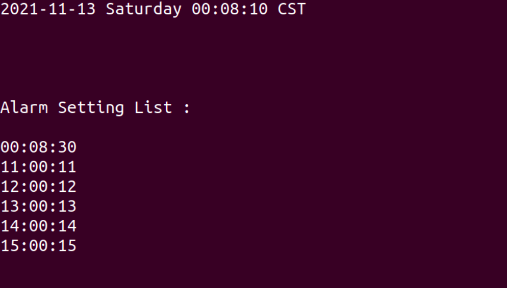
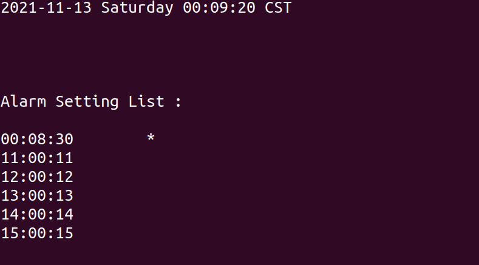

# terminal-alarm-clock

## HOW TO USE THIS SOFTWARE

### 1. Install packages

```
$ apt install libncurses-dev libvlc-dev


# libncurses-dev is a library and software for terminal handling 
# libvlc-dev is a vlc library for handling audio

```

### 2. Download this repository

```
$ cd terminal-alarm-clock/ && make
```


### 3. Configure yours alarm time-code list

Edit alarm_list file, set the time-codes.  


### 4. You could put your favorite audio for alarm went-off audio

for example:

Your audio file name is "MY_FAVORITE_MUSIC", and put it into MY_DIRECTORY

so your file path is 
```
./MY_DIRECTORY/MY_FAVORITE_MUSIC
```

Edit ./src/audio_player.c 

find the function signature called : "alarm_player_routine"

```c

void *alarm_player_routine(void *arg)

modify this line of code from :
m = libvlc_media_new_path(inst, "./alarm_ringtone/ringtone_example");

to :
m = libvlc_media_new_path(inst, "./MY_DIRECTORY/MY_FAVORITE_MUSIC");

then, execute the commands

$ make clean

$ make

```

### Start the terminal alarm clock
```
$ cd terminal-alarm-clock/  && ./terminal-alarm-clock

```

### Clock running



### Clock running and alarm goes-off 
